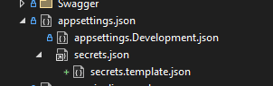

# UserSecrets

Tools and configuration templates to help manage user secrets during development, making it easier to keep secrets synchronized across team members.

## TL;DR - Quick Start

Improve your team's user secrets management with these simple additions to your project:

```xml
<!-- Add to Directory.Build.props next to your solution file -->
<Project>
    <ItemGroup Condition="'$(UserSecretsId)' != ''">
        <None Include="$([System.Environment]::GetFolderPath(SpecialFolder.ApplicationData))\Microsoft\UserSecrets\$(UserSecretsId)\secrets.json" Link="secrets.json" />
        <None Include="secrets.template.json" />
    </ItemGroup>
</Project>
```

```json
// Add .filenesting.json next to your solution file
{
  "help": "https://go.microsoft.com/fwlink/?linkid=866610",
  "dependentFileProviders": {
    "add": {
      "fileToFile": {
        "add": {
          "secrets.json": ["secrets.template.json"]
        }
      }
    }
  }
}
```

Benefits:
- Makes secrets.json visible in Visual Studio
- Provides template files for new developers
- Shows which secrets are expected
- Helps keep secrets synchronized across the team

## Deep Dive

While appsettings.json and appsettings.Development.json can contain base configuration and development-specific settings, as soon as it comes to sensitive values, like connectionstrings etc, you shouldn't commit them to your repo.

Some put secrets in Development.json and de-lists it from git, but there is already a feature in VS and .Net for this. Its called UserSecrets. UserSecrets are stored in you AppData/Roaming-folder and is of course not tracked in git.

As with other common "non-committed-file"-based solutions to this problem, it is quite hard to keep user secrets updated among developers, and we constantly get errors because someone else added some code that expects a secret value in a config, which is therefor not checked in.

This is not a solution, but it helps a bit.

### Implementation Steps

1. Make the secrets.json show up in visual studio, so that you know that user secrets should be configured for this project. Place this code in a file called Directory.Build.Props next to your solution file, and the secrets-file will be linked in for all projects that has user-secrets configured.

```xml
<Project>
	<ItemGroup Condition="'$(UserSecretsId)' != ''">
		<None Include="$([System.Environment]::GetFolderPath(SpecialFolder.ApplicationData))\Microsoft\UserSecrets\$(UserSecretsId)\secrets.json" Link="secrets.json" />
		<None Include="secrets.template.json" />
	</ItemGroup>
</Project>
```

2. Add a usersecrets.template.json to all projects with usersecrets configured. This file can contain examples or nonsensitive default values expected to be found in secrets.json. Now a developer can check if their secrets.json is symmetrical to the template. To make this file show up nicely nested under the secrets.json, add the following code to a file called .filenesting.json next to your solution file.

```json
{
  "help": "https://go.microsoft.com/fwlink/?linkid=866610",
  "dependentFileProviders": {
    "add": {
      "fileToFile": {
        "add": {
          "secrets.json": ["appsettings.json"]
        }
      }
    }
  }
}
```

Restart vs and your projects with usersecrets enabled should look like this


